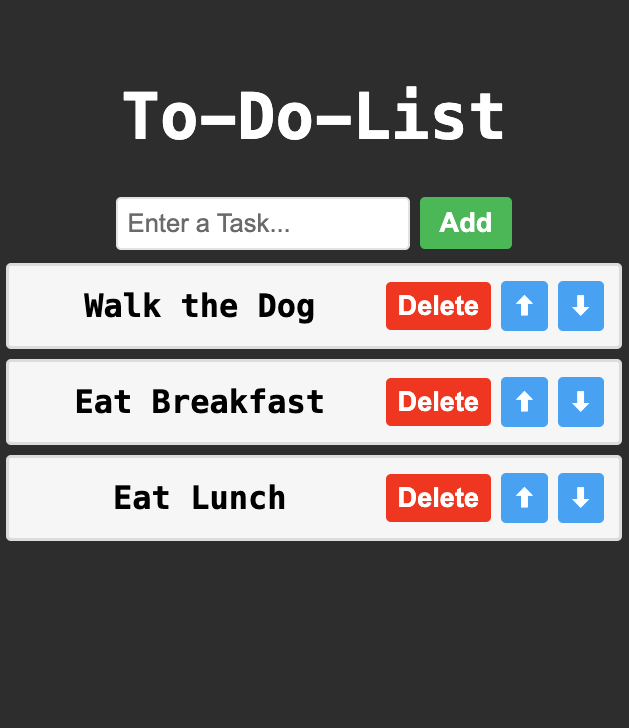

# React To-Do List

A fully functional to-do list application built with **React** using hooks. Add, delete, and reorder tasks with a clean, modern interface featuring color-coded buttons and smooth hover effects.

## Features
- ✅ Add new tasks with input validation
- ❌ Delete tasks individually
- ⬆️ Move tasks up in the list
- ⬇️ Move tasks down in the list
- 🎨 Dark theme with color-coded action buttons
- 🔄 Smooth hover transitions with scale effect
- 📝 Pre-populated with sample tasks
- 💾 State management using React hooks (useState)

## Requirements
- Node.js (v14 or higher)
- npm or yarn package manager
- React (v18 or higher recommended)

## Project structure
```
.
├── src/
│   ├── App.jsx
│   ├── ToDoList.jsx
│   ├── index.css
│   └── main.jsx (or index.jsx)
├── package.json
└── README.md
```

## Installation

1. **Clone or download the project**

2. **Install dependencies**
```bash
npm install
# or
yarn install
```

3. **Run the development server**
```bash
npm run dev
# or
yarn dev
```

4. **Open in browser**
Navigate to `http://localhost:5173` (or the port shown in your terminal)

## Screenshots


* The to-do list interface features:
  - **"To-Do-List" heading** (4rem, white, centered)
  - **Input field** (1.6rem) with placeholder "Enter a Task..."
  - **Add button** (green, `hsl(125, 47%, 54%)`)
  - **Ordered list** of tasks with:
    - Task text aligned left
    - **Delete button** (red, `hsl(10, 90%, 50%)`)
    - **Move Up button** (blue, `hsl(207, 90%, 64%)`) with ⬆ emoji
    - **Move Down button** (blue, `hsl(207, 90%, 64%)`) with ⬇ emoji
  - **Dark background** (`hsl(0, 0%, 20%)`)
  - White task cards with light borders
  - All buttons scale up (1.05x) on hover

## Usage

### Adding a task
1. Type your task in the input field
2. Click the **Add** button or press Enter
3. The task appears at the bottom of the list
4. Input field clears automatically

### Deleting a task
- Click the **Delete** button next to any task to remove it

### Reordering tasks
- Click **⬆** to move a task up one position
- Click **⬇** to move a task down one position
- Top task cannot move up further
- Bottom task cannot move down further

## Component Architecture

### App.jsx
Main application component that renders the ToDoList component:
```javascript
import ToDoList from "./ToDoList.jsx"

function App() {
    return <ToDoList />;
}
```

### ToDoList.jsx
Core component containing all functionality:

**State Management:**
```javascript
const [tasks, setTasks] = useState(["Eat Breakfast", "Take a Shower", "Walk the Dog"]);
const [newTask, setNewTasks] = useState("");
```

**Key Functions:**

**1. handleInputChange(event)**
- Updates `newTask` state as user types
- Controlled input component pattern
```javascript
function handleInputChange(event) {
    setNewTasks(event.target.value);
}
```

**2. addTask()**
- Validates input is not empty (uses `trim()`)
- Adds new task to end of array using spread operator
- Clears input field after adding
```javascript
function addTask() {
    if(newTask.trim() !== "") {
        setTasks(prevTasks => [...prevTasks, newTask]);
        setNewTasks("");
    }
}
```

**3. deleteTask(index)**
- Uses `filter()` method to remove task at specified index
- Creates new array excluding the deleted task
```javascript
function deleteTask(index) {
    const updatedTasks = tasks.filter((_, i) => i !== index);
    setTasks(updatedTasks);
}
```

**4. moveTaskUp(index)**
- Checks if task is not already at top (`index > 0`)
- Swaps task with the one above using array destructuring
```javascript
function moveTaskUp(index) {
    if(index > 0) {
        const updatedTasks = [...tasks];
        [updatedTasks[index], updatedTasks[index - 1]] = 
        [updatedTasks[index - 1], updatedTasks[index]];
        setTasks(updatedTasks);
    }
}
```

**5. moveTaskDown(index)**
- Checks if task is not already at bottom (`index < tasks.length - 1`)
- Swaps task with the one below using array destructuring
```javascript
function moveTaskDown(index) {
    if(index < tasks.length - 1) {
        const updatedTasks = [...tasks];
        [updatedTasks[index], updatedTasks[index + 1]] = 
        [updatedTasks[index + 1], updatedTasks[index]];
        setTasks(updatedTasks);
    }
}
```

## Rendering Logic

Uses `map()` to render tasks dynamically:
```javascript
{tasks.map((tasks, index) => 
    <li key={index}>
        <span className="text">{tasks}</span>
        <button className="delete-button" onClick={() => deleteTask(index)}>Delete</button>
        <button className="move-button" onClick={() => moveTaskUp(index)}>⬆</button>
        <button className="move-button" onClick={() => moveTaskDown(index)}>⬇</button>
    </li>
)}
```

## Styling

### Color Scheme
- **Background**: Dark gray (`hsl(0, 0%, 20%)`)
- **Heading**: White
- **Task cards**: Off-white (`hsl(0, 0%, 97%)`)
- **Add button**: Green (`hsl(125, 47%, 54%)`)
- **Delete button**: Red (`hsl(10, 90%, 50%)`)
- **Move buttons**: Blue (`hsl(207, 90%, 64%)`)

### Button Effects
- **Hover**: Darker shade + 5% scale increase (`transform: scale(1.05)`)
- **Transition**: Smooth 0.5s ease-in animation

### Layout
- Tasks displayed as numbered list (`<ol>`)
- Flexbox layout for task items
- Task text takes up remaining space (`flex: 1`)
- Buttons aligned to the right

## Customize

### Initial Tasks
Modify the default tasks array:
```javascript
const [tasks, setTasks] = useState(["Your Task 1", "Your Task 2", "Your Task 3"]);
```

### Colors
Change HSL values in `index.css`:
- Add button: `.add-button { background-color: hsl(...); }`
- Delete button: `.delete-button { background-color: hsl(...); }`
- Move buttons: `.move-button { background-color: hsl(...); }`

### Font Sizes
- Heading: `font-size: 4rem;`
- Tasks: `font-size: 2rem;`
- Buttons: `font-size: 1.7rem;`
- Input: `font-size: 1.6rem;`

### Hover Scale
Modify the `transform` property:
```css
button:hover {
    transform: scale(1.05); /* Change to 1.1 for more dramatic effect */
}
```

## React Concepts Used

- **Hooks**: `useState` for state management
- **Event Handlers**: `onClick`, `onChange`
- **Controlled Components**: Input value tied to state
- **Array Methods**: `map()`, `filter()`, spread operator
- **Conditional Rendering**: Validation checks
- **Key Props**: Unique `key={index}` for list items
- **Arrow Functions**: Inline event handlers
- **Destructuring**: Array swapping technique

## Input Validation

The app includes validation to prevent empty tasks:
```javascript
if(newTask.trim() !== "") {
    // Only add if not empty after trimming whitespace
}
```

This prevents adding tasks that are:
- Empty strings
- Only whitespace
- Only spaces/tabs

## State Management Best Practices

- Uses **updater function** in `addTask()` to ensure latest state:
```javascript
  setTasks(prevTasks => [...prevTasks, newTask]);
```
- Creates **new arrays** instead of mutating state directly
- Uses **spread operator** for immutability
- Clears input after successful task addition

## Notes

- Tasks persist only during the current session (not saved to storage)
- Uses monospace font for consistent appearance
- Index-based key props (acceptable for this use case since tasks aren't reordered externally)
- Move buttons have boundary checks to prevent errors
- All buttons have consistent spacing (10px margin-left)
- Input field clears only on successful task addition (not on empty submit)

## Possible Enhancements

- Add localStorage to persist tasks across sessions
- Implement task editing functionality
- Add task completion checkboxes
- Include timestamps for tasks
- Add task categories/tags
- Implement search/filter functionality
- Add task priority levels
- Enable drag-and-drop reordering
- Add "Clear All" button
- Implement undo/redo functionality
- Add task due dates
- Export/import task lists

## Build for Production
```bash
npm run build
# or
yarn build
```

This creates an optimized production build in the `dist` folder.

---

Stay organized! ✅